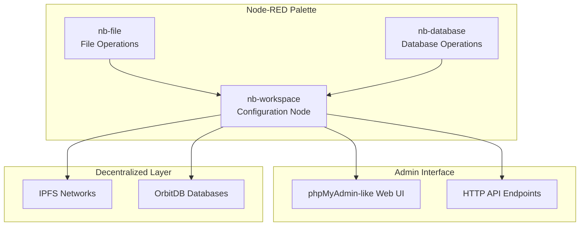

# Nodebit: Unified IPFS & OrbitDB for Node-RED

**Nodebit** provides a phpMyAdmin-like interface for decentralized storage in Node-RED. Manage IPFS networks, OrbitDB databases, and files through an intuitive web interface while building powerful automation flows.

## 🎯 What is Nodebit?

Nodebit transforms Node-RED into a comprehensive platform for decentralized data management. It combines the visual flow programming of Node-RED with the power of IPFS and OrbitDB, providing both programmatic access and a rich administrative interface.

### Core Capabilities
- **📊 phpMyAdmin-like Admin Interface**: Comprehensive web UI for browsing networks, databases, and files
- **🗄️ OrbitDB Database Management**: Create, query, and manage decentralized databases
- **📁 IPFS File Operations**: Upload, download, and manage files across IPFS networks
- **🌐 Multi-Network Support**: Connect to multiple IPFS networks simultaneously
- **🔄 Real-time Integration**: Live updates and monitoring within Node-RED flows
- **⚙️ Configuration Management**: Easy setup and management of decentralized infrastructure

## 🚀 Quick Start

### Installation
```bash
cd ~/.node-red
npm install nodebit
```

### Basic Setup
1. **Restart Node-RED** to load the Nodebit nodes
2. **Create a workspace configuration**:
   - Go to hamburger menu → Configuration nodes
   - Add a new "nb-workspace" configuration
   - Give it a name like "My Workspace"
3. **Access the Admin Interface**:
   - In the workspace configuration, click "Open Workspace Admin"
   - Browse networks, databases, and files in the web interface

### Your First Flow
```
[inject] → [nb-file] → [debug]
```

1. **Configure inject node**: Set payload to "Hello, IPFS!"
2. **Configure nb-file node**: Select your workspace, operation: "auto"
3. **Deploy and test**: Click inject to upload your first file to IPFS

## 📦 Node Overview

| Node | Purpose | Status | Description |
|------|---------|--------|-------------|
| **nb-workspace** | Configuration & Admin | ✅ Working | Central hub with phpMyAdmin-like interface |
| **nb-file** | IPFS file operations | ✅ Demo | Upload, download, pin/unpin files |
| **nb-database** | OrbitDB operations | ✅ Demo | Create, query, manage databases |
| **nb-encrypt** | Encryption services | ✅ Optional | Encrypt/decrypt data in flows |

## 🖥️ Admin Interface Features

The phpMyAdmin-like interface provides comprehensive management capabilities:

### 📊 Overview Dashboard
- **Network Statistics**: Connected IPFS networks and peer counts
- **Database Metrics**: OrbitDB instances, entry counts, storage usage
- **File Management**: IPFS files, pin status, storage distribution
- **Recent Activity**: Live feed of operations and changes

### 🌐 Networks Tab
- **IPFS Network Browser**: View all connected networks
- **Peer Information**: Peer IDs, connection status, capabilities
- **Network Statistics**: Bandwidth, latency, availability metrics
- **Connection Management**: Add, remove, configure networks

### 🗄️ Databases Tab
- **OrbitDB Browser**: Browse all databases across networks
- **Database Types**: Documents, key-value, event logs, feeds, counters
- **Schema Viewer**: Inspect database structures and indexes
- **Query Interface**: Execute queries and view results

### 📁 Files Tab
- **IPFS File Browser**: Navigate files across all networks
- **Metadata Viewer**: File sizes, types, upload dates, pin status
- **Bulk Operations**: Pin/unpin multiple files, batch downloads
- **Storage Analytics**: Usage patterns and optimization suggestions

### 🔍 Query Builder (Coming Soon)
- **Visual Query Designer**: Drag-and-drop query construction
- **Cross-Database Joins**: Query across multiple OrbitDB instances
- **Export Capabilities**: CSV, JSON, and custom format exports
- **Saved Queries**: Store and reuse complex queries

## 🏗️ Architecture

Nodebit uses a **resource-centric** design focused on data management rather than connection complexity:



### Key Design Principles
1. **Configuration Node Pattern**: nb-workspace acts as a shared configuration
2. **Admin Interface Integration**: Web UI embedded in Node-RED
3. **Resource Abstraction**: Work with files and databases, not protocols
4. **Progressive Disclosure**: Simple tasks are simple, complex tasks are possible

## 📚 Documentation

- **[Getting Started Guide](docs/getting-started.md)** - Step-by-step setup and first flows
- **[Architecture Guide](docs/technical/architecture.md)** - Technical design and patterns
- **[Node Reference](docs/technical/node-roles.md)** - Detailed documentation for each node
- **[Examples](docs/reference/examples/)** - Real-world use cases and patterns
- **[Contributor Guide](docs/README.md)** - Development status, technical docs, and contribution guidelines

## 🎓 Example Use Cases

### Personal Cloud Storage
```
[File Upload] → [nb-encrypt: encrypt] → [nb-file: store] → [Share Link Generator]
```

### Distributed Database Application
```
[HTTP Request] → [nb-database: query] → [Template] → [HTTP Response]
```

### Real-time Data Sync
```
[Timer] → [nb-database: sync check] → [Notification] → [Slack/Email]
```

### Content Distribution Network
```
[RSS Feed] → [nb-file: cache content] → [nb-database: index] → [API Response]
```

## 🔧 Current Implementation Status

### ✅ Working Features
- **Configuration Management**: Full workspace configuration with validation
- **Admin Interface**: Complete phpMyAdmin-like web interface
- **Demo Operations**: File upload/download and database operations with mock data
- **Node-RED Integration**: Proper palette integration and flow composition
- **HTTP API**: RESTful endpoints for programmatic access

### 🚧 Demo Mode
Currently, all operations use mock data to demonstrate functionality:
- **File Operations**: Generate mock CIDs, simulate uploads/downloads
- **Database Operations**: In-memory storage, simulated OrbitDB operations
- **Network Management**: Mock IPFS networks and peer connections

### 🔮 Planned Real Implementation
- **IPFS Integration**: Replace mock operations with real Helia/IPFS calls
- **OrbitDB Integration**: Connect to actual OrbitDB instances
- **Network Discovery**: Automatic IPFS node detection and connection
- **Advanced Security**: DID/ACL system with decentralized identity management

## 🤝 Contributing

We welcome contributions! The current demo implementation provides a solid foundation for adding real IPFS and OrbitDB functionality.

### Development Setup
```bash
git clone https://github.com/nodebit/nodebit
cd nodebit
npm install
npm link
cd ~/.node-red
npm link nodebit
```

### Key Areas for Contribution
1. **IPFS Integration**: Replace mock file operations with real Helia calls
2. **OrbitDB Integration**: Implement actual database operations
3. **Network Discovery**: Add automatic IPFS node detection
4. **Security Features**: Implement encryption and access control
5. **Performance Optimization**: Caching, batching, and efficiency improvements

## 📄 License

MIT License - see [LICENSE](LICENSE) for details.

## 🙏 Acknowledgments

Built on the shoulders of giants:
- [IPFS](https://ipfs.io/) - The InterPlanetary File System
- [OrbitDB](https://orbitdb.org/) - Decentralized databases
- [Helia](https://github.com/ipfs/helia) - Modern IPFS implementation
- [Node-RED](https://nodered.org/) - Visual programming for IoT

---

**Ready to explore decentralized data management?** Start with the [Getting Started Guide](docs/getting-started.md)!