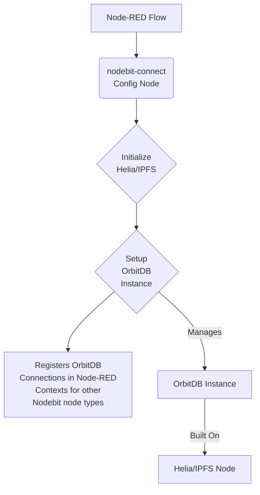
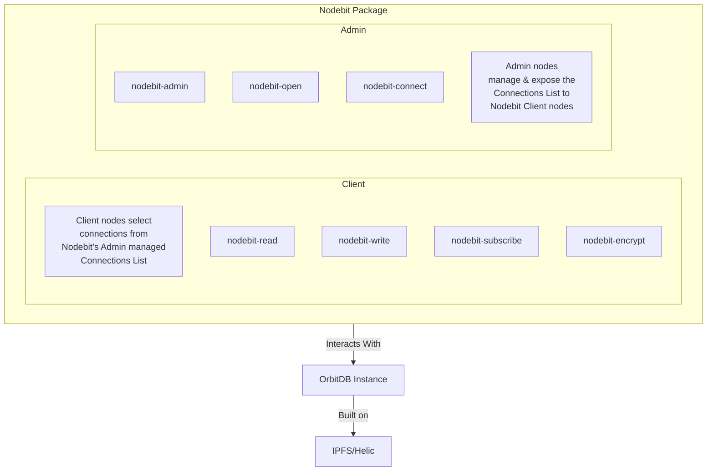

# Nodebit Functional Specification

## 🧩 Modules Included in `nodebit` Package

The `nodebit` package will contain several modules, logically grouped into Admin and Client components, each serving a specific purpose in interacting with OrbitDB and IPFS.

### 🔐 Admin Component

The Admin component of the Nodebit suite is responsible for managing configuration and metadata related to OrbitDB instances. It includes the following nodes:

*   **`nodebit-connect`**: A configuration node responsible for managing a single, local Helia IPFS instance or connecting to an external IPFS daemon, and setting up the OrbitDB client instance.
*   **`nodebit-admin`**: Provides an administrative user interface within Node-RED for browsing and managing OrbitDB instances. It acts as a control panel, similar to `phpMyAdmin` or `Firebase Console`, allowing for inspection, modification, and control over decentralized data within the Node Red environment. It provides a user interface for:
    *   Connecting to OrbitDB peers: Establishing and managing connections to various OrbitDB peers.
    *   Listing databases: Displaying a list of available OrbitDB databases.
    *   Showing keys, logs, and peer status: Providing insights into the operational status and security aspects of OrbitDB instances.
    *   Exporting/importing data: Facilitating data migration and backup operations.
*   **`nodebit-open`**: Allows users to open existing OrbitDB databases or create new ones with specified configurations.
Both `nodebit-admin` and `nodebit-open` nodes rely on any one of the connections being exposed by any one of the `nodebit-connect` nodes within the scope of the flow in which they are being used.

#### Technical Details of `nodebit-connect`

`nodebit-connect` will function as a Node-RED configuration node, designed to hold shared configuration information for OrbitDB connections. Its primary goal is to manage a single, local Helia IPFS instance or connect to an external IPFS daemon, and then configure, test, store, and expose working connections to *already existing* OrbitDB instances. These connections are made available for other Nodebit nodes like `nodebit-admin`, `nodebit-open`, `nodebit-read`, `nodebit-write`, and `nodebit-subscribe`. It is important to note that `nodebit-connect` does *not* create new OrbitDB instances; it facilitates interaction with pre-existing ones.

Here's a breakdown of its technical role:

1.  **Helia/IPFS Connection Initialization:**
    *   OrbitDB, being a decentralized database, relies on IPFS (InterPlanetary File System) for data storage and peer-to-peer communication.
    *   `nodebit-connect` will be responsible for either spinning up and managing a single, local Helia instance (a modern, lightweight IPFS implementation in TypeScript) or connecting to an existing external IPFS daemon. This involves:
        *   Starting an IPFS node (a Helia instance) within the Node-RED runtime (if local).
        *   Configuring the IPFS node, potentially including peer discovery mechanisms, storage paths, and network settings.
        *   Ensuring the IPFS node is connected to the broader IPFS network, allowing it to find and communicate with other peers.

2.  **OrbitDB Instance Setup:**
    *   Once the Helia/IPFS connection is established, `nodebit-connect` will use this IPFS instance to create and manage the OrbitDB instance.
    *   This involves:
        *   Instantiating the `OrbitDB` library, passing the initialized IPFS instance to it.
        *   Potentially configuring OrbitDB-specific settings, such as the directory for local data storage or custom access controllers.

3.  **Node-RED Connection Registration:**
    *   The core mechanism for `nodebit-connect` to provide its established OrbitDB connection to other Nodebit nodes is through Node-RED's configuration node system.
    *   When a user configures a `nodebit-connect` node in the Node-RED editor, they will define parameters for the IPFS and OrbitDB setup.
    *   This configuration node will then expose its established OrbitDB instance (and potentially the underlying IPFS instance) as a reusable "connection" or "service."
    *   Other Nodebit nodes (e.g., `nodebit-read`, `nodebit-write`) will have a property in their configuration panel that allows users to select an existing `nodebit-connect` instance.
    *   Behind the scenes, Node-RED handles the linking, so when `nodebit-read` needs to interact with OrbitDB, it retrieves the pre-initialized OrbitDB instance from the selected `nodebit-connect` configuration node.

In essence, `nodebit-connect` acts as the central point for establishing and managing the decentralized data layer (IPFS and OrbitDB) within Node-RED, making it seamlessly available for all other Nodebit functional nodes without requiring each node to handle its own connection logic. This ensures consistency, resource efficiency, and ease of use for the end-user.

### 📦 Client Component

The Client component focuses on executing operations within Node-RED flows. These nodes are lightweight and flow-focused, designed to interact with OrbitDB using preconfigured connections established by the Admin component. These include:

*   **`nodebit-read`**: For reading data from OrbitDB.
*   **`nodebit-write`**: For writing data to OrbitDB.
*   **`nodebit-subscribe`**: For subscribing to real-time updates from OrbitDB.
*   **`nodebit-encrypt`**: Handles encryption and decryption of data payloads before they are written to or read from OrbitDB, ensuring data privacy.

These nodes enable users to build automation and data processing workflows directly within Node-RED.

### 🔗 The Relationship: Admin and Client Interaction

The Admin and Client components work in a coordinated manner:

*   The **Admin node** is used to create and manage OrbitDB instances or connections. These connections are typically configured once and then referenced by client nodes.
*   The **Client nodes** utilize these pre-established connections via a shared reference, often through a Node-RED config node. This pattern ensures that decentralized data is both **manageable** (via Admin) and **composable** (within Node-RED flows using Client nodes).

## ⚙️ Technical Dependencies

The `nodebit` package will rely on the following core dependencies:

*   `ipfs`: For underlying IPFS functionality.
*   `orbit-db`: The core OrbitDB library for decentralized databases.
*   `helia`: A modern IPFS implementation in TypeScript, used for connecting to the IPFS network.

The `package.json` will define these dependencies and the Node-RED specific node configurations.

## Nodebit Node Relationship Diagram

