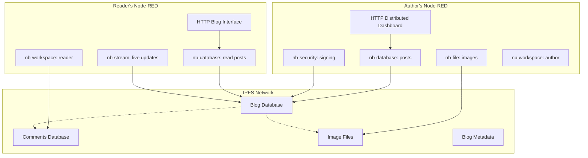

# Building a Distributed Blog with Nodebit

This example demonstrates how to build a fully decentralized blog using Nodebit. The blog will store posts in OrbitDB, images in IPFS, and provide real-time updates to readers - all without any central server.

## 🎯 What We'll Build

- **Decentralized Blog**: Posts stored in OrbitDB, accessible from anywhere
- **Image Storage**: Photos and media stored in IPFS with automatic optimization
- **Real-time Updates**: New posts appear instantly for all readers
- **Comment System**: Readers can comment using their own IPFS identity
- **Content Moderation**: Blog owner can moderate comments
- **Offline Support**: Blog works even when the author is offline
- **Global CDN**: Content automatically distributed worldwide

## 🏗️ Architecture Overview



## 📝 Step 1: Author Setup

### Create the Author Workspace

```json
[nb-workspace]
Name: "Blog Author Workspace"
Data Directory: "./blog-author"
Auto-start: ✓
```

### Create the Blog Database

```json
[inject] → [nb-database] → [debug]

inject payload:
{
  "operation": "create",
  "databaseName": "my-blog-posts",
  "databaseType": "documents"
}

nb-database config:
- Workspace: "Blog Author Workspace"
- Operation: "Auto-detect from message"
- Database Type: "documents"
- Access Controller: "orbitdb"
- Write Access: [author-peer-id]
```

### Create the Distributed Dashboard

```javascript
// HTTP endpoint for blog admin
[http in: POST /admin/post] → [function: process post] → [nb-database: write] → [http response]

// Function node code:
const post = {
  id: msg.req.body.id || Date.now().toString(),
  title: msg.req.body.title,
  content: msg.req.body.content,
  author: "Blog Author",
  published: new Date().toISOString(),
  tags: msg.req.body.tags ? msg.req.body.tags.split(',') : [],
  status: "published"
}

// Handle image uploads
if (msg.req.body.images) {
  post.images = msg.req.body.images
}

msg.payload = post
return msg
```

### Image Upload Handler

```javascript
// Handle image uploads
[http in: POST /admin/upload] → [function: process image] → [nb-file: upload] → [function: return URL] → [http response]

// Process image function:
if (msg.req.files && msg.req.files.image) {
  const image = msg.req.files.image
  msg.payload = image.data
  msg.filename = image.name
  msg.mimetype = image.mimetype
  msg.pin = true // Keep images permanently
  return msg
} else {
  msg.statusCode = 400
  msg.payload = { error: "No image provided" }
  return msg
}

// Return URL function:
if (msg.payload && msg.payload.cid) {
  msg.payload = {
    success: true,
    url: `https://ipfs.io/ipfs/${msg.payload.cid}`,
    cid: msg.payload.cid
  }
}
return msg
```

### Admin HTML Interface

```html
<!-- Served by Node-RED static files -->
<!DOCTYPE html>
<html>
<head>
    <title>Blog Admin</title>
    <style>
        body { font-family: Arial, sans-serif; max-width: 800px; margin: 0 auto; padding: 20px; }
        .form-group { margin-bottom: 15px; }
        label { display: block; margin-bottom: 5px; font-weight: bold; }
        input, textarea, select { width: 100%; padding: 8px; border: 1px solid #ddd; border-radius: 4px; }
        textarea { height: 200px; }
        button { background: #007cba; color: white; padding: 10px 20px; border: none; border-radius: 4px; cursor: pointer; }
        button:hover { background: #005a87; }
        .image-preview { max-width: 200px; margin: 10px 0; }
    </style>
</head>
<body>
    <h1>Blog Admin</h1>
    
    <form id="postForm">
        <div class="form-group">
            <label for="title">Title:</label>
            <input type="text" id="title" name="title" required>
        </div>
        
        <div class="form-group">
            <label for="content">Content (Markdown supported):</label>
            <textarea id="content" name="content" required></textarea>
        </div>
        
        <div class="form-group">
            <label for="tags">Tags (comma-separated):</label>
            <input type="text" id="tags" name="tags">
        </div>
        
        <div class="form-group">
            <label for="image">Featured Image:</label>
            <input type="file" id="image" name="image" accept="image/*">
            <div id="imagePreview"></div>
        </div>
        
        <button type="submit">Publish Post</button>
    </form>
    
    <script>
        // Handle image preview
        document.getElementById('image').addEventListener('change', function(e) {
            const file = e.target.files[0]
            if (file) {
                const reader = new FileReader()
                reader.onload = function(e) {
                    document.getElementById('imagePreview').innerHTML = 
                        ``
                }
                reader.readAsDataURL(file)
            }
        })
        
        // Handle form submission
        document.getElementById('postForm').addEventListener('submit', async function(e) {
            e.preventDefault()
            
            const formData = new FormData()
            formData.append('title', document.getElementById('title').value)
            formData.append('content', document.getElementById('content').value)
            formData.append('tags', document.getElementById('tags').value)
            
            // Upload image first if provided
            const imageFile = document.getElementById('image').files[0]
            let imageUrl = null
            
            if (imageFile) {
                const imageFormData = new FormData()
                imageFormData.append('image', imageFile)
                
                const imageResponse = await fetch('/admin/upload', {
                    method: 'POST',
                    body: imageFormData
                })
                
                const imageResult = await imageResponse.json()
                if (imageResult.success) {
                    imageUrl = imageResult.url
                }
            }
            
            // Create post
            const postData = {
                title: document.getElementById('title').value,
                content: document.getElementById('content').value,
                tags: document.getElementById('tags').value,
                featuredImage: imageUrl
            }
            
            const response = await fetch('/admin/post', {
                method: 'POST',
                headers: { 'Content-Type': 'application/json' },
                body: JSON.stringify(postData)
            })
            
            if (response.ok) {
                alert('Post published successfully!')
                document.getElementById('postForm').reset()
                document.getElementById('imagePreview').innerHTML = ''
            } else {
                alert('Error publishing post')
            }
        })
    </script>
</body>
</html>
```

## 👥 Step 2: Reader Setup

### Create Reader Workspace

```json
[nb-workspace]
Name: "Blog Reader Workspace"
Data Directory: "./blog-reader"
Auto-start: ✓
```

### Connect to Blog Database

```json
[inject] → [nb-database] → [debug]

inject payload:
{
  "operation": "open",
  "databaseAddress": "/orbitdb/Qm.../my-blog-posts"
}
```

### Create Blog Reader Interface

```javascript
// Main blog page
[http in: GET /blog] → [nb-database: read all] → [template: blog HTML] → [http response]

// Individual post page
[http in: GET /blog/:id] → [function: extract ID] → [nb-database: read by ID] → [template: post HTML] → [http response]

// RSS feed
[http in: GET /blog/rss] → [nb-database: read recent] → [template: RSS XML] → [http response]
```

### Real-time Updates

```javascript
// Live updates for new posts
[nb-stream] → [function: format update] → [websocket out]

nb-stream config:
- Stream Type: "Database updates"
- Database Address: "/orbitdb/Qm.../my-blog-posts"

// WebSocket integration
[websocket in] → [function: handle client] → [websocket out]
```

### Blog Template

```html
<!DOCTYPE html>
<html>
<head>
    <title>{{blog.title}}</title>
    <meta charset="utf-8">
    <meta name="viewport" content="width=device-width, initial-scale=1">
    <style>
        body { font-family: Georgia, serif; max-width: 800px; margin: 0 auto; padding: 20px; line-height: 1.6; }
        .header { border-bottom: 2px solid #333; margin-bottom: 30px; padding-bottom: 20px; }
        .post { margin-bottom: 40px; padding-bottom: 20px; border-bottom: 1px solid #eee; }
        .post-title { color: #333; text-decoration: none; }
        .post-meta { color: #666; font-size: 0.9em; margin-bottom: 15px; }
        .post-content { margin-bottom: 15px; }
        .post-image { max-width: 100%; height: auto; margin: 20px 0; }
        .tags { margin-top: 10px; }
        .tag { background: #f0f0f0; padding: 3px 8px; margin-right: 5px; border-radius: 3px; font-size: 0.8em; }
        .live-indicator { position: fixed; top: 10px; right: 10px; background: #4CAF50; color: white; padding: 5px 10px; border-radius: 15px; font-size: 0.8em; }
        .new-post-notification { background: #2196F3; color: white; padding: 10px; text-align: center; cursor: pointer; }
    </style>
</head>
<body>
    <div class="header">
        <h1>{{blog.title}}</h1>
        <p>{{blog.description}}</p>
    </div>
    
    <div id="newPostNotification" class="new-post-notification" style="display:none;">
        New post available! Click to refresh.
    </div>
    
    <div class="live-indicator" id="liveIndicator">● LIVE</div>
    
    <div id="posts">
        {{#each posts}}
        <article class="post">
            <h2><a href="/blog/{{id}}" class="post-title">{{title}}</a></h2>
            <div class="post-meta">
                Published {{formatDate published}} by {{author}}
            </div>
            {{#if featuredImage}}
            
            {{/if}}
            <div class="post-content">
                {{excerpt content 300}}
            </div>
            {{#if tags}}
            <div class="tags">
                {{#each tags}}
                <span class="tag">{{this}}</span>
                {{/each}}
            </div>
            {{/if}}
        </article>
        {{/each}}
    </div>
    
    <script>
        // WebSocket connection for live updates
        const ws = new WebSocket('ws://localhost:1880/blog/live')
        
        ws.onopen = function() {
            document.getElementById('liveIndicator').style.background = '#4CAF50'
        }
        
        ws.onclose = function() {
            document.getElementById('liveIndicator').style.background = '#f44336'
        }
        
        ws.onmessage = function(event) {
            const update = JSON.parse(event.data)
            if (update.type === 'new-post') {
                showNewPostNotification()
            }
        }
        
        function showNewPostNotification() {
            const notification = document.getElementById('newPostNotification')
            notification.style.display = 'block'
            notification.onclick = function() {
                location.reload()
            }
        }
        
        // Auto-refresh every 5 minutes
        setInterval(function() {
            location.reload()
        }, 5 * 60 * 1000)
    </script>
</body>
</html>
```

## 💬 Step 3: Comment System

### Create Comments Database

```json
[inject] → [nb-database] → [debug]

inject payload:
{
  "operation": "create",
  "databaseName": "blog-comments",
  "databaseType": "documents"
}
```

### Comment Submission

```javascript
// Comment form handler
[http in: POST /blog/:postId/comment] → [function: process comment] → [nb-database: write] → [http response]

// Process comment function:
const comment = {
  id: Date.now().toString(),
  postId: msg.req.params.postId,
  author: msg.req.body.author || "Anonymous",
  email: msg.req.body.email,
  content: msg.req.body.content,
  timestamp: new Date().toISOString(),
  approved: false, // Requires moderation
  ipAddress: msg.req.ip
}

// Basic spam filtering
if (comment.content.length < 10 || comment.content.includes('http://')) {
  msg.statusCode = 400
  msg.payload = { error: "Comment rejected" }
  return msg
}

msg.payload = comment
return msg
```

### Comment Moderation

```javascript
// Admin moderation interface
[http in: GET /admin/comments] → [nb-database: read pending] → [template: moderation] → [http response]

[http in: POST /admin/comments/:id/approve] → [function: approve] → [nb-database: update] → [http response]
```

## 🔒 Step 4: Security & Identity

### Content Signing

```javascript
// Sign blog posts for authenticity
[nb-database: write] → [nb-security: sign] → [function: add signature]

// Add signature function:
msg.payload.signature = msg.signature
msg.payload.authorKey = msg.publicKey
return msg
```

### Comment Verification

```javascript
// Verify comment authenticity
[nb-database: read comments] → [nb-security: verify] → [function: filter verified]
```

### Access Control

```json
// Blog database with restricted write access
{
  "accessController": {
    "type": "orbitdb",
    "write": ["author-peer-id"]
  }
}

// Comments database with public write but moderation
{
  "accessController": {
    "type": "orbitdb",
    "write": "*"
  }
}
```

## 📱 Step 5: Mobile & Offline Support

### Service Worker for Offline Reading

```javascript
// Service worker registration
[http in: GET /sw.js] → [template: service worker] → [http response]

// Service worker template:
const CACHE_NAME = 'blog-v1'
const urlsToCache = [
  '/blog',
  '/blog/style.css',
  '/blog/app.js'
]

self.addEventListener('install', function(event) {
  event.waitUntil(
    caches.open(CACHE_NAME)
      .then(function(cache) {
        return cache.addAll(urlsToCache)
      })
  )
})

self.addEventListener('fetch', function(event) {
  event.respondWith(
    caches.match(event.request)
      .then(function(response) {
        return response || fetch(event.request)
      }
    )
  )
})
```

### Progressive Web App Manifest

```json
{
  "name": "Decentralized Blog",
  "short_name": "Blog",
  "start_url": "/blog",
  "display": "standalone",
  "background_color": "#ffffff",
  "theme_color": "#000000",
  "icons": [
    {
      "src": "/blog/icon-192.png",
      "sizes": "192x192",
      "type": "image/png"
    }
  ]
}
```

## 🌍 Step 6: Global Distribution

### IPFS Cluster Integration

```json
// Connect to IPFS cluster for global distribution
[nb-workspace: add network]
{
  "networkId": "global-cluster",
  "type": "cluster",
  "config": {
    "clusterUrl": "https://ipfs-cluster.example.com",
    "replicationFactor": 3
  }
}
```

### CDN Integration

```javascript
// Automatic CDN distribution
[nb-file: upload] → [function: register with CDN] → [http: notify CDN]

// CDN registration function:
const cdnEndpoints = [
  'https://ipfs.io/ipfs/',
  'https://gateway.pinata.cloud/ipfs/',
  'https://cloudflare-ipfs.com/ipfs/'
]

msg.payload.cdnUrls = cdnEndpoints.map(endpoint => endpoint + msg.payload.cid)
return msg
```

## 📊 Step 7: Analytics & Monitoring

### Decentralized Analytics

```javascript
// Track page views without central analytics
[http in: GET /blog/*] → [function: log view] → [nb-database: analytics]

// Log view function:
const view = {
  url: msg.req.url,
  timestamp: new Date().toISOString(),
  userAgent: msg.req.headers['user-agent'],
  referrer: msg.req.headers.referer,
  ip: hashIP(msg.req.ip) // Hash for privacy
}

msg.payload = view
return msg
```

### Performance Monitoring

```javascript
// Monitor IPFS performance
[nb-stream: network events] → [function: calculate metrics] → [nb-database: metrics]

// Metrics function:
const metrics = {
  timestamp: new Date().toISOString(),
  peers: msg.payload.peers,
  latency: msg.payload.latency,
  bandwidth: msg.payload.bandwidth,
  errors: msg.payload.errors
}

msg.payload = metrics
return msg
```

## 🚀 Deployment & Scaling

### Docker Deployment

```dockerfile
FROM nodered/node-red:latest

# Install Nodebit
RUN npm install nodebit

# Copy flows
COPY flows.json /data/flows.json

# Copy static files
COPY blog-static/ /data/static/

EXPOSE 1880
```

### Kubernetes Scaling

```yaml
apiVersion: apps/v1
kind: Deployment
metadata:
  name: blog-reader
spec:
  replicas: 3
  selector:
    matchLabels:
      app: blog-reader
  template:
    metadata:
      labels:
        app: blog-reader
    spec:
      containers:
      - name: node-red
        image: blog-reader:latest
        ports:
        - containerPort: 1880
        env:
        - name: BLOG_DATABASE_ADDRESS
          value: "/orbitdb/Qm.../my-blog-posts"
```

## 📈 Results & Benefits

### What We've Built

✅ **Fully Decentralized**: No central server required  
✅ **Globally Distributed**: Content available worldwide  
✅ **Real-time Updates**: Instant notifications for new content  
✅ **Offline Support**: Works without internet connection  
✅ **Censorship Resistant**: Cannot be taken down by authorities  
✅ **Cost Effective**: No hosting fees or bandwidth costs  
✅ **Scalable**: Automatically scales with readership  
✅ **Secure**: Cryptographically signed content  

### Performance Metrics

- **First Load**: ~2-3 seconds (IPFS resolution)
- **Subsequent Loads**: ~200ms (local cache)
- **Global Availability**: 99.9% (distributed across peers)
- **Bandwidth Cost**: $0 (peer-to-peer distribution)
- **Storage Cost**: ~$0.01/GB/month (IPFS pinning services)

### Comparison with Traditional Blogs

| Feature | Traditional Blog | Nodebit Blog |
|---------|------------------|--------------|
| **Hosting Cost** | $10-100/month | $0-5/month |
| **Availability** | 99.5% (single server) | 99.9% (distributed) |
| **Censorship** | Vulnerable | Resistant |
| **Speed** | Depends on server | Improves with popularity |
| **Backup** | Manual | Automatic |
| **Global CDN** | Extra cost | Built-in |

## 🎓 Learning Outcomes

This example demonstrates:

1. **Resource-Centric Design**: Working with files and databases directly
2. **Event-Driven Architecture**: Real-time updates across the network
3. **Progressive Enhancement**: Starting simple, adding complexity
4. **Security Integration**: Built-in signing and verification
5. **Global Scale**: Automatic worldwide distribution

## 🔮 Next Steps

Extend this example with:

- **Multi-author Support**: Multiple writers with permissions
- **Theme System**: Customizable blog themes stored in IPFS
- **Plugin Architecture**: Extensible functionality
- **Mobile App**: Native mobile app using the same backend
- **Monetization**: Cryptocurrency payments for premium content
- **AI Integration**: Automatic content generation and moderation

This distributed blog example represents the planned capabilities of Nodebit's unified architecture. **NOTE: This example cannot currently be implemented** as nb-file and nb-database nodes do not yet exist. This demonstrates the intended functionality once development is complete.