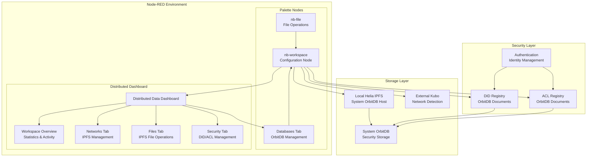
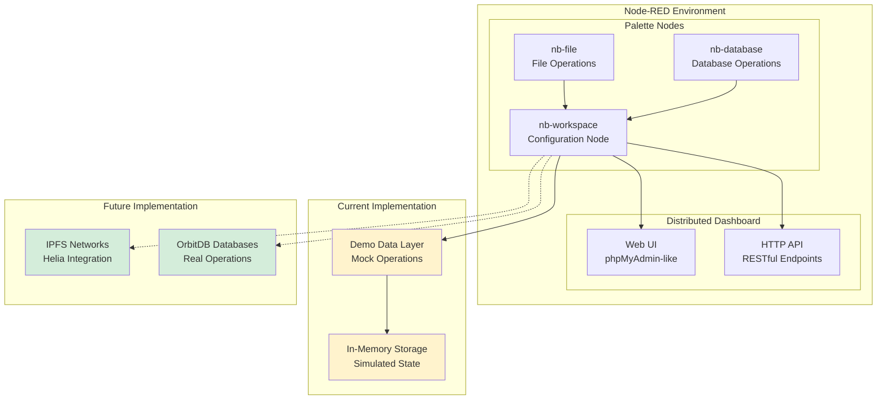
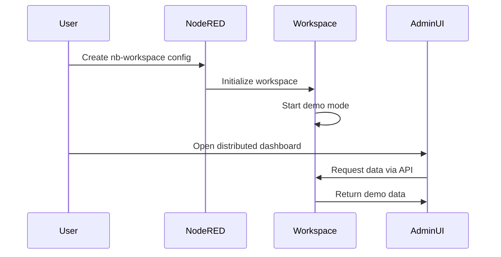
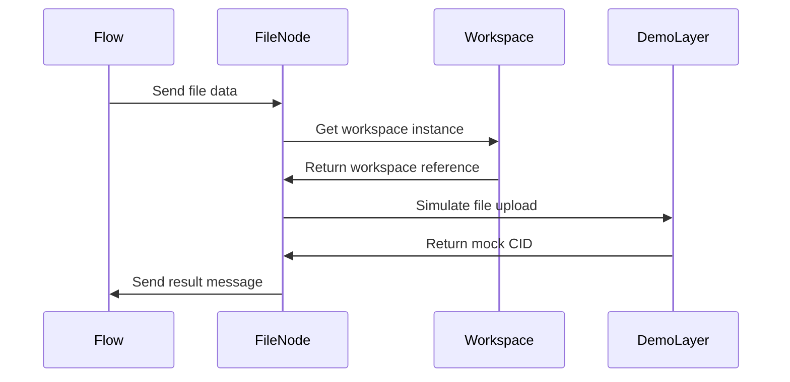

# Nodebit Architecture Guide

This document explains Nodebit's current architecture, design principles, and implementation details. It covers both the working demo implementation and the planned real IPFS/OrbitDB integration.

## 🎯 Design Philosophy

Nodebit is built around a **resource-centric** architecture that prioritizes user intent over technical complexity. Users work directly with files and databases through both programmatic flows and a comprehensive distributed dashboard.

### Core Principles

1. **Resource-First Design**
   - Users manage files and databases, not network connections
   - Operations are intuitive: "store this file" vs "connect to IPFS then add file"
   - Resources are the primary abstraction, not protocols

2. **Distributed Dashboard Integration**
   - phpMyAdmin-like web interface embedded in Node-RED
   - Comprehensive visibility into decentralized infrastructure
   - Real-time monitoring and management capabilities
   - **Professional CSS Grid-Based Security Management**
   - **Enterprise-Grade ACL Interface**: Three-panel workflow (Users/Resources/Permissions)
   - **Fixed-Width Responsive Design**: Proper layout constraints and overflow handling
   - **Comprehensive DID Account Management**: Full metadata editing with professional forms
   - **Real-time Permission Management**: Immediate grant/revoke capabilities
   - Username-centric design with automatic DID generation
   - Real-time search and filtering across DID properties
   - Inline avatar management and metadata editing

3. **Configuration Node Pattern**
   - Single workspace configuration shared across multiple nodes
   - Follows Node-RED best practices for shared resources
   - Clean separation between configuration and operation

4. **Progressive Disclosure**
   - Simple tasks require minimal configuration
   - Advanced features available but not required
   - Demo mode for learning and development

## 🏗️ Current Architecture

**With DID/ACL Security System:**



**Base Architecture:**



## 🧩 Component Architecture

### nb-workspace (Configuration Node)

The central hub that manages all decentralized resources and provides the distributed dashboard.

**Current Implementation:**
```javascript
function NodebitWorkspaceNode(config) {
    // Configuration storage
    this.config = {
        name: config.name || 'Nodebit Workspace',
        dataDir: config.dataDir || '.nodebit',
        autoStart: config.autoStart !== false
    };
    
    // State management
    this.isStarted = false;
    this.networks = new Map();
    this.resources = new Map();
    
    // Demo startup simulation
    setTimeout(() => {
        this.isStarted = true;
        this.log('Workspace started in demo mode');
    }, 1000);
}
```

**Key Responsibilities:**
- **Configuration Management**: Store workspace settings and preferences
- **State Tracking**: Monitor workspace status and resource availability
- **Distributed Dashboard**: Serve web interface for managing distributed data
- **API Endpoints**: Provide RESTful access to workspace data
- **Resource Coordination**: Manage connections between nodes

**Distributed Dashboard Features:**
- **Workspace Overview**: Central dashboard with statistics and recent activity
- **Networks Tab**: IPFS network management and monitoring
- **Databases Tab**: OrbitDB browser and query interface
- **Files Tab**: IPFS file manager with pin control
- **Query Builder**: Advanced query construction (planned)

### nb-file (File Operations Node)

Handles all IPFS file operations with automatic workspace integration.

**Current Implementation:**
```javascript
// Demo file upload
const mockCID = 'QmDemo' + Math.random().toString(36).substr(2, 44);
result = {
    topic: 'file.uploaded',
    payload: {
        cid: mockCID,
        file: { name, size, type },
        demo: true,
        links: { ipfs: `https://ipfs.io/ipfs/${mockCID}` }
    }
};
```

**Operations Supported:**
- **Upload**: Add files to IPFS (currently generates mock CIDs)
- **Download**: Retrieve files by CID (currently returns demo content)
- **Pin/Unpin**: Control file persistence (currently simulated)
- **Metadata**: Get file information (currently mock data)

**Message Patterns:**
```javascript
// Upload
msg.payload = "Hello IPFS!"
msg.filename = "greeting.txt"

// Download  
msg.payload = "QmDemo123..."

// Pin
msg.operation = "pin"
msg.payload = "QmDemo123..."
```

### nb-database (Database Operations Node)

Provides unified access to OrbitDB operations across different database types.

**Current Implementation:**
```javascript
// Demo database operations using in-memory Map
node.mockDatabase = new Map();

// Write operation
const id = Date.now().toString();
node.mockDatabase.set(id, msg.payload);
```

**Database Types Supported:**
- **Documents**: JSON documents with query capabilities
- **Key-Value**: Simple key-value pairs
- **Event Log**: Append-only log entries
- **Feed**: Mutable log with add/remove capabilities
- **Counter**: Distributed counter operations

**Operations:**
- **Create**: Initialize new databases
- **Read**: Query data with filtering
- **Write**: Insert new data
- **Update**: Modify existing data
- **Delete**: Remove data
- **Sync**: Coordinate with peers (planned)

## 🌐 Distributed Dashboard Architecture

### Web Interface Structure

The phpMyAdmin-like interface is served directly from the nb-workspace node:

```javascript
// Main distributed dashboard endpoint
RED.httpAdmin.get('/nodebit/workspace/:id/admin', 
    RED.auth.needsPermission('nb-workspace.read'), 
    function(req, res) {
        const adminHTML = generateAdminInterface(node);
        res.send(adminHTML);
    }
);
```

### API Endpoints

RESTful API for programmatic access:

```javascript
// Network information
GET /nodebit/workspace/:id/api/networks

// Database listing
GET /nodebit/workspace/:id/api/databases  

// File management
GET /nodebit/workspace/:id/api/files
```

### Frontend Architecture

**Technology Stack:**
- **HTML5**: Semantic markup with responsive design
- **CSS3**: Modern styling with flexbox and grid layouts
- **Vanilla JavaScript**: No external dependencies for maximum compatibility
- **AJAX**: Asynchronous data loading and updates

**UI Components:**
- **Tab Navigation**: Switch between different management views
- **Data Tables**: Sortable, searchable tables for resources
- **Statistics Cards**: Real-time metrics and status indicators
- **Action Buttons**: Context-sensitive operations
- **Loading States**: Progressive loading with user feedback

## 🔄 Data Flow Architecture

### Configuration Flow



### Operation Flow



## 📊 State Management

### Workspace State

```javascript
// Current state structure
{
    isStarted: boolean,
    networks: Map<string, NetworkInfo>,
    resources: Map<string, ResourceInfo>,
    config: {
        name: string,
        dataDir: string,
        autoStart: boolean
    }
}
```

### Demo Data Generation

**Networks:**
```javascript
const networks = [
    {
        id: 'local-helia',
        name: 'Local Helia',
        type: 'helia',
        status: 'connected',
        peerId: 'QmDemo...',
        peers: 12,
        databases: 3
    }
];
```

**Databases:**
```javascript
const databases = [
    {
        id: 'db1',
        name: 'user-profiles',
        type: 'documents',
        address: '/orbitdb/QmDemo.../user-profiles',
        network: 'local-helia',
        entries: 156,
        size: '2.3 MB'
    }
];
```

## 🔒 Security Architecture

### Current Security Model

**Node-RED Integration:**
- Uses Node-RED's built-in authentication system
- Respects Node-RED permissions for distributed dashboard access
- Follows Node-RED security best practices

**API Security:**
```javascript
RED.httpAdmin.get('/nodebit/workspace/:id/admin', 
    RED.auth.needsPermission('nb-workspace.read'), 
    handler
);
```

### Planned Security Features

**IPFS Security:**
- Private IPFS networks
- Content encryption before storage
- Access control lists (ACLs)

**OrbitDB Security:**
- Database-level permissions
- Identity-based access control
- Cryptographic signatures

**Application Security:**
- DID (Decentralized Identity) integration
- End-to-end encryption
- Audit logging

## 🚀 Performance Architecture

### Current Performance Characteristics

**Demo Mode Performance:**
- **Instant Operations**: No network latency
- **Unlimited Throughput**: In-memory operations
- **Zero Storage**: No persistent data

**UI Performance:**
- **Lazy Loading**: Data loaded on tab activation
- **Caching**: Browser-side caching of static resources
- **Responsive Design**: Optimized for various screen sizes

### Planned Performance Optimizations

**IPFS Performance:**
- **Connection Pooling**: Reuse IPFS connections
- **Batch Operations**: Group multiple operations
- **Local Caching**: Cache frequently accessed content

**OrbitDB Performance:**
- **Query Optimization**: Efficient database queries
- **Index Management**: Automatic index creation
- **Replication Control**: Selective data replication

## 🔮 Migration Architecture

### Demo to Real Implementation

The architecture is designed for seamless migration:

**Phase 1: IPFS Integration**
```javascript
// Replace demo operations with real Helia calls
const { unixfs } = require('@helia/unixfs');
const cid = await fs.addFile({ content: fileData });
```

**Phase 2: OrbitDB Integration**
```javascript
// Replace in-memory storage with real OrbitDB
const { createOrbitDB } = require('@orbitdb/core');
const db = await orbitdb.open(databaseName, { type: 'documents' });
```

**Phase 3: Network Discovery**
```javascript
// Add automatic IPFS node detection
const networks = await discoverIPFSNodes();
```

### Backward Compatibility

**API Stability:**
- Distributed dashboard API remains unchanged
- Node-RED message formats stay consistent
- Configuration options preserved

**Flow Compatibility:**
- Existing flows work without modification
- Same input/output message patterns
- Identical node configuration options

## 📈 Scalability Architecture

### Horizontal Scaling

**Multiple Workspaces:**
- Support multiple workspace configurations
- Independent IPFS networks per workspace
- Isolated resource management

**Distributed Operations:**
- Load balancing across IPFS nodes
- Distributed OrbitDB replication
- Peer-to-peer resource sharing

### Vertical Scaling

**Resource Optimization:**
- Efficient memory usage patterns
- Connection pooling and reuse
- Intelligent caching strategies

**Performance Monitoring:**
- Real-time performance metrics
- Resource usage tracking
- Bottleneck identification

## 🛠️ Development Architecture

### Code Organization

```
nodes/
├── workspace/          # Configuration node + distributed dashboard
│   ├── workspace.js   # Node logic + HTTP endpoints
│   └── workspace.html # Configuration UI
├── file/              # File operations
│   ├── file.js       # IPFS file operations
│   └── file.html     # Node configuration UI
└── database/          # Database operations
    ├── database.js   # OrbitDB operations
    └── database.html # Node configuration UI
```

### Extension Points

**Plugin Architecture:**
- Custom database types
- Additional file operations
- Extended distributed dashboard features

**API Extensions:**
- Custom HTTP endpoints
- WebSocket support for real-time updates
- GraphQL interface for complex queries

This architecture represents the planned design for Nodebit. Currently, only basic nb-workspace functionality exists. nb-file and nb-database nodes require complete implementation. The DID/ACL security system needs substantial development. This is early-stage development with significant work remaining to achieve the described functionality.