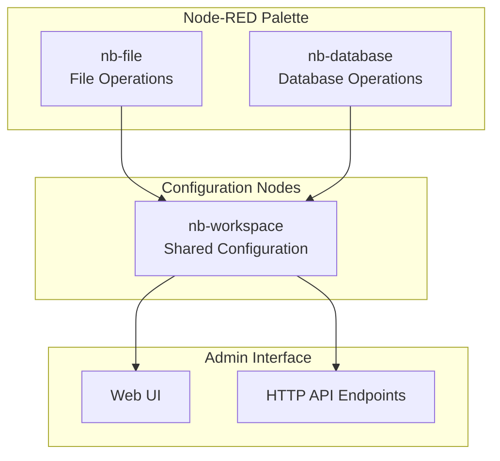

# Nodebit Node Roles and Responsibilities

**Warning: Nodebit is in early development. Most node types are incomplete, and message formats may change.**

This document is the canonical source for node types, configuration, and message formats. For DID structure and API, see [DID Management Guide](./did-management-guide.md).

## Architecture Overview

Nodebit uses a configuration node pattern where nb-workspace acts as a shared configuration that other nodes reference. This follows Node-RED best practices and provides a clean separation between configuration and operation.



## Configuration Node

### nb-workspace (Shared Configuration)
**Type**: Configuration Node  
**Category**: config  
**Status**: Early Development  

**Primary Role**: Central hub for workspace management and dashboard

**Current Capabilities:**
- Real IPFS integration (Helia, Kubo detection)
- Configuration storage (name, data directory, auto-start)
- State management (workspace status, network data)
- Dashboard (activity log, network info)
- HTTP API endpoints
- Node coordination (provides Helia to other nodes)

**Configuration Properties:**
```javascript
{
    name: "My Workspace",           // Display name
    dataDir: ".nodebit",           // Data storage directory
    autoStart: true                  // Auto-start local IPFS node
}
```

## Flow Nodes

### nb-file (IPFS File Operations)
**Type**: Flow Node  
**Category**: nodebit  
**Status**: Not Implemented  

**Primary Role**: Handle IPFS file operations (planned)

**Current Capabilities:**
- File upload (planned)
- File download (planned)
- Pin management (planned)
- Metadata handling (planned)
- Workspace integration (planned)

**Configuration Properties:**
```javascript
{
    name: "File Operations",       // Node display name
    workspace: "workspace-id",     // Reference to nb-workspace config
    operation: "auto"              // Operation mode (auto, upload, download, pin, unpin, info)
}
```

**Input Message Formats:**
- Buffer data: `msg.payload = Buffer.from("Hello IPFS!"); msg.filename = "greeting.txt";`
- File path: `msg.file = "/path/to/document.pdf";`
- Data URL: `msg.payload = "data:image/png;base64,...";`
- Base64 string: `msg.payload = "SGVsbG8gSVBGUyE="; msg.filename = "encoded-file.txt";`

**File Download:**
- `msg.payload = "QmDemo123...";  // CID to download`
- `msg.outputFormat = "auto";     // auto, buffer, base64`

**Pin Operations:**
- `msg.operation = "pin";         // or "unpin"`
- `msg.payload = "QmDemo123...";  // CID to pin/unpin`

**Output Message Formats:**
- Upload Success: `{ topic: "file.uploaded", payload: { cid, file, demo, links } }`
- Download Success: `{ topic: "file.downloaded", payload, file }`

**Current Limitations:**
- Files are not actually stored on IPFS (demo mode)
- CIDs are generated randomly for demonstration
- Download operations return mock content
- Pin operations are simulated

### nb-database (OrbitDB Operations)
**Type**: Flow Node  
**Category**: nodebit  
**Status**: Demo Mode  

**Primary Role**: Unified access to OrbitDB database operations (planned)

**Current Capabilities:**
- Database creation (simulated)
- Data operations (create, read, update, delete; simulated)
- Type support: documents, key-value, event log, feed, counter (simulated)
- Workspace integration (planned)

**Configuration Properties:**
```javascript
{
    name: "Database Operations",   // Node display name
    workspace: "workspace-id",     // Reference to nb-workspace config
    operation: "auto",             // Operation mode
    databaseName: "my-db",         // Database identifier
    databaseType: "documents"      // Database type
}
```

**Input/Output Message Formats:**
- See [functional.md](./functional.md) for examples.

**Current Limitations:**
- Data stored in memory only (not persistent)
- No actual OrbitDB database creation
- No peer-to-peer synchronization
- Simulated database addresses

## Node Relationships

- nb-file and nb-database nodes reference nb-workspace for configuration and coordination.
- Status indicators: green (ready), yellow (starting), red (error/no workspace), blue (in progress).

## Design Patterns

- Auto-detection: operation inferred from message content unless explicitly set.
- Error handling: nodes check workspace readiness and configuration.

## DID/ACL

For DID structure, API, and ACL integration, see [DID Management Guide](./did-management-guide.md).

## Future Implementation

- Real IPFS and OrbitDB integration is planned.
- Demo mode remains available for development.
- Message formats and configuration may change as features are implemented.